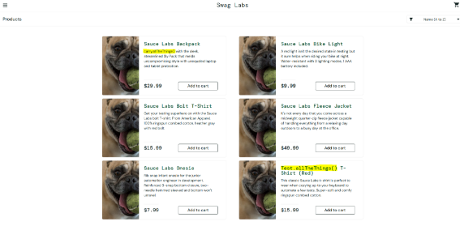
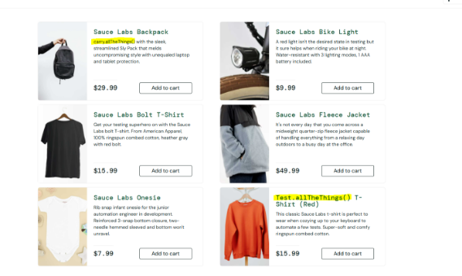
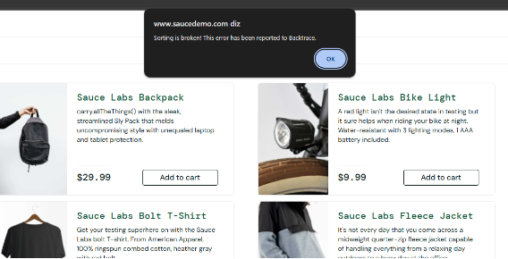
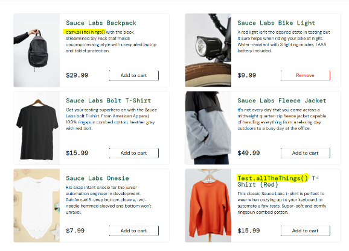
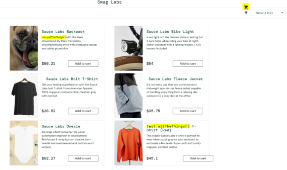
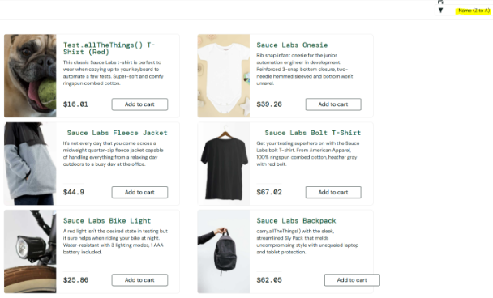
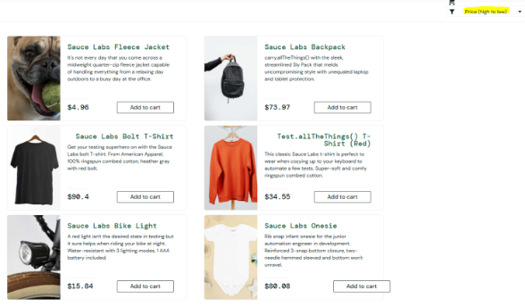
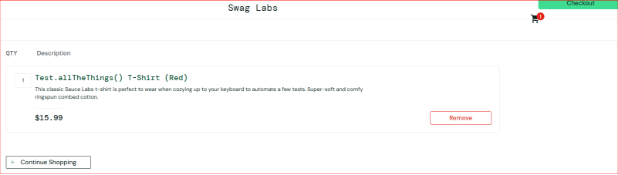
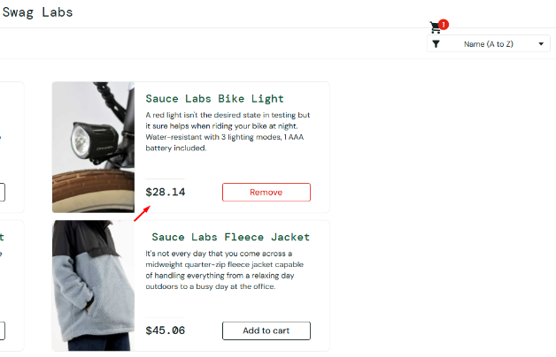
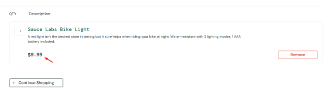

**1. Dados Gerais**  

|**Nome do Sistema**|Sauce Demo|
| :- | :- |
|**Versão Testada**|V 1.0|
|**Data do Teste**||
|**Responsável pelo Teste**|Cristielem Vilaça Dos Santos|
|**Tipo de Teste**|Funcional|

 

**2. Objetivo do Teste**

Garantir a funcionalidade correta de cada módulo, testar a estabilidade do sistema, testar se as páginas do site estão responsivas, testar se há adaptabilidade na aplicação.

 

**3. Ambiente de Teste**

- **Sistema Operacional:** Windows 10
- **Hardware**: Intel(R) Core(TM) i5, memória 8 gb
- **Ferramentas Utilizadas:**

 

**4. Plano de Teste**

**1. Login com diferentes tipos de usuários**

- **Cenário 1:** Validar o Login com os usuários válidos.
- **Cenário 2:** Validar o Login/Senha inválidos.
- **Cenário 3:** Validar o Login sem preencher os campos obrigatórios. 
- **Cenário 4:** Validar o Login com o usuário bloqueado.

**2. Ordenação e filtragem de produtos**

- **Cenário 5:** Ordenar produtos por preço do menor para o maior.
- **Cenário 6:** Ordenar produtos por preço do maior para o menor.
- **Cenário 7:** Ordenar produtos por nome de (A-Z) e (Z-A).

**3. Fluxo completo de compra (do carinho até finalização)**

- **Cenário 8:** Adicionar um item ao carrinho e finalizar compra.
- **Cenário 9:** Adicionar múltiplos itens ao carrinho e finalizar o pedido.
- **Cenário 10:** Validar os campos do checkout, sem preencher os campos obrigatórios.

**4. Remoção de itens do carrinho**

- **Cenário 11:** Adicionar um item ao carrinho e remover.
- **Cenário 12:** Adicionar múltiplos itens e remover.
- **Cenário 13:** Remover itens durante a etapa de checkout.
- **Cenário 14:** Validar o botão “Continuar comprando” no carrinho.

**5. Navegação entre páginas**

- **Cenário 15:** Navegar entre páginas do catálogo (carrinho, checkout e confirmação).
- **Cenário 16:** Validar o botão “Voltar” do navegador.

**6. Logout**

- **Cenário 17:** Realizar logout diretamente após o login.
- **Cenário 18:** Realizar logout no meio do checkout.
- **Cenário 19:** Validar se os dados do usuário são limpos após o logout.

 

**5. Casos de Teste**

**ID do caso de teste**: CT - 001|
| :- |
|**Descrição do caso de Teste**: Validar o Login com os usuários válidos|
|**Pré-Condições:** Usuário cadastrado|
|
**Passos:** 1. Abrir o sistema

2. Inserir o login válido
|
|**Resultado esperado**: Login realizado com sucesso|
|**Resultado obtido**: Login realizado com sucesso|
|**Status**: Aprovado|

 

|**ID do caso de teste**: CT - 002|
| :- |
|**Descrição do caso de Teste**: Validar o Login/Senha inválidos|
|**Pré-Condições:** Usuário cadastrado|
|
**Passos:** 1. Abrir o sistema

2. Inserir o login ou senha inválido
|
|**Resultado esperado**: Mensagem de usuário não cadastrado|
|**Resultado obtido**: Mensagem de usuário não cadastrado|
|**Status**: Aprovado|

 

|**ID do caso de teste**: CT - 003|
| :- |
|**Descrição do caso de Teste**: Validar o Login sem preencher os campos obrigatórios.|
|**Pré-Condições:** Usuário cadastrado|
|
**Passos:** 1. Abrir o sistema

2. Logar sem preencher os campos obrigatórios.
|
|**Resultado esperado**: Mensagem de nome de usuário é obrigatório.|
|**Resultado obtido**: Mensagem de nome de usuário é obrigatório.|
|**Status**: Aprovado|

 

|**ID do caso de teste**: CT - 004|
| :- |
|**Descrição do caso de Teste**: Validar o Login com o usuário bloqueado.|
|**Pré-Condições:** Usuário cadastrado|
|
**Passos:** 1. Abrir o sistema

2. Logar com o usuário bloqueado
|
|**Resultado esperado**: Mensagem de usuário bloqueado.|
|**Resultado obtido**: Mensagem de usuário bloqueado.|
|**Status**: Aprovado|

 

|**ID do caso de teste**: CT - 005|
| :- |
|**Descrição do caso de Teste**: Ordenar produtos por preço do menor para o maior.|
|**Pré-Condições:** Usuário logado|
|
**Passos:** 1. Clicar no filtro

2. Escolher o filtro - Price (low to high)
|
|**Resultado esperado**: Ordenação dos preços dos produtos do menor para o maior.|
|**Resultado obtido**: Ordenação dos preços dos produtos do menor para o maior.|
|**Status**: Aprovado|

 

|**ID do caso de teste**: CT - 006|
| :- |
|**Descrição do caso de Teste**:  Ordenar produtos por preço do maior para o menor.|
|**Pré-Condições:** Usuário logado|
|
**Passos:** 1. Clicar no filtro

2. Escolher o filtro - Price (high to low)
|
|**Resultado esperado**:  Ordenação dos preços dos produtos do maior para o menor.|
|**Resultado obtido**:  Ordenação dos preços dos produtos do maior para o menor.|
|**Status**: Aprovado|

 

|**ID do caso de teste**: CT - 007|
| :- |
|**Descrição do caso de Teste**:  Ordenar produtos por nome de (A-Z) e (Z-A).|
|**Pré-Condições:** Usuário logado|
|
**Passos:** 1. Clicar no filtro

2. Escolher o filtro - Name (A to Z) 

3. Escolher o filtro – Name (Z to A)

|
|**Resultado esperado**: Ordenação dos nomes de A a Z / Z a A.|
|**Resultado obtido**: Ordenação dos nomes de A a Z / Z a A.|
|**Status**: Aprovado|

 

|**ID do caso de teste**: CT - 008|
| :- |
|**Descrição do caso de Teste**: Adicionar um item ao carrinho e finalizar compra.|
|**Pré-Condições:** Usuário logado|
|
**Passos:** 1. Adicionar um produto ao carrinho

2. Clicar no ícone do ‘Carrinho’

3. Clicar em ‘Checkout’

4. Preencher os campos obrigatórios

5. Clicar em ‘Continue’

6. Clicar em ‘Finish’
|
|**Resultado esperado**: Compra realizada com sucesso.|
|**Resultado obtido**: Compra realizada com sucesso.|
|**Status**: Aprovado|

 

|**ID do caso de teste**: CT - 009|
| :- |
|**Descrição do caso de Teste:**  Adicionar múltiplos itens ao carrinho e finalizar o pedido.|
|**Pré-Condições:** Usuário logado|
|
**Passos:** 1. Adicionar mais de um produto ao carrinho

2. Clicar no ícone do ‘Carrinho’

3. Clicar em ‘Checkout’

4. Preencher os campos obrigatórios

5. Clicar em ‘Continue’

6. Clicar em ‘Finish’
|
|**Resultado esperado:** Compra com mais de um item realizada com sucesso.|
|**Resultado obtido:** Compra com mais de um item realizada com sucesso.|
|**Status**: Aprovado|

 

|**ID do caso de teste**: CT - 010|
| :- |
|**Descrição do caso de Teste:**  Validar os campos do checkout, sem preencher os campos obrigatórios.|
|**Pré-Condições:** Usuário logado|
|
**Passos:** 1. Adicionar um produto ao carrinho

2. Clicar no ícone do ‘Carrinho’

3. Clicar em ‘Checkout’

4. Clicar em ‘Continue’
|
|**Resultado esperado:** Exibir mensagem de erro (**Error: First Name is required)**.|
|**Resultado obtido:** Mensagem de erro foi exibida como esperado.|
|**Status**: Aprovado|

 

|**ID do caso de teste**: CT - 011|
| :- |
|**Descrição do caso de Teste:** Adicionar um item ao carrinho e remover.|
|**Pré-Condições:** Usuário logado|
|
**Passos:** 1. Adicionar um produto ao carrinho

2. Clicar em ‘Remove’
|
|**Resultado esperado:** Item removido sem erros.|
|**Resultado obtido:** Item removido sem erros.|
|**Status**: Aprovado|

 

|**ID do caso de teste**: CT - 012|
| :- |
|**Descrição do caso de Teste:** Adicionar múltiplos itens e remover.|
|**Pré-Condições:** Usuário logado|
|
**Passos:** 1. Adicionar múltiplos itens ao carrinho

2. Clicar em ‘Remove’ em cada item
|
|**Resultado esperado:** Itens removido sem erros e carrinho vazio.|
|**Resultado obtido:** Itens removidos sem erros e carrinho vazio.|
|**Status**: Aprovado|

 

|**ID do caso de teste**: CT - 013|
| :- |
|**Descrição do caso de Teste:**  Remover itens durante a etapa de checkout.|
|**Pré-Condições:** Usuário logado|
|
**Passos:** 1. Adicionar produto ao carrinho

2. Clicar em ‘Checkout’

3. Clicar em ‘Cancel’

4. Clicar em ‘Remove’
|
|**Resultado esperado:** Item removido sem erros no checkout.|
|**Resultado obtido:** Item foi removido sem erros.|
|**Status**: Aprovado|

 

|**ID do caso de teste**: CT - 014|
| :- |
|**Descrição do caso de Teste:** Validar o botão “Continue Shopping” no carrinho.|
|**Pré-Condições:** Usuário logado|
|
**Passos:** 1. Clicar no ícone do carrinho

2. Clicar em ‘Continue Shopping’
|
|**Resultado esperado:** Ao clicar no botão ‘Continue Shopping’, o mesmo deve voltar a página principal sem erros.|
|**Resultado obtido:** Botão ‘Continue Shopping’ funcionando sem ocorrer erros.|
|**Status**: Aprovado|

 

|**ID do caso de teste**: CT - 015|
| :- |
|**Descrição do caso de Teste**: Navegar entre páginas do catálogo (carrinho, checkout e confirmação).|
|**Pré-Condições:** Usuário logado|
|
**Passos:** 1. Clicar no ícone do carrinho

2. Clicar em ‘Checkout’

3. Clicar em ‘Finish’
|
|**Resultado esperado:** Ao realizar a navegação entre as páginas não deve ocorrer travamento.|
|**Resultado obtido:** Não houve travamento nas páginas navegadas, todas as páginas funcionando corretamente.|
|**Status**: Aprovado|

 

|**ID do caso de teste**: CT - 016|
| :- |
|**Descrição do caso de Teste:** Validar o botão “Voltar” do navegador.|
|**Pré-Condições:** Usuário logado|
|
**Passos:** 1. Realizar qualquer ação no sistema.

2.  Clicar no ‘Voltar’ do navegador.
|
|**Resultado esperado:** Ao clicar no ‘Voltar’ do navegador, deve realizar a ação para voltar a páginas anterior sem erros e sem travamentos.|
|**Resultado obtido:** Ao executar a ação voltar pelo navegador, o mesmo volta para a página desejada sem travamento e sem erros.|
|**Status**: Aprovado|

 

|**ID do caso de teste**: CT - 017|
| :- |
|**Descrição do caso de Teste:** Realizar logout após realizar o login.|
|**Pré-Condições:** Usuário cadastrado|
|
**Passos:** 1. Realizar o login

2. Clicar em ‘Login’

3. Clica em ‘Logout’ no menu lateral
|
|**Resultado esperado:** Logout realizado sem erros e retorna para a página de login.|
|**Resultado obtido:** Logout realizado sem erros.|
|**Status**: Aprovado|

 

|**ID do caso de teste**: CT - 018|
| :- |
|**Descrição do caso de Teste:**  Realizar logout no meio do checkout.|
|**Pré-Condições:** Usuário logado|
|
**Passos:** 1. Adicionar item ao carrinho

2. Clicar no ícone do carrinho

3. Clicar em ‘Checkout’

3. Clicar no menu lateral

4. Clicar na opção ‘Logout’
|
|**Resultado esperado:** Logout realizado sem erros.|
|**Resultado obtido:** Logout realizado sem erros.|
|**Status**: Aprovado|

 

|**ID do caso de teste**: CT - 019|
| :- |
|**Descrição do caso de Teste:** Validar se os dados do usuário são limpos após o logout.|
|**Pré-Condições:** Usuário cadastrado|
|
**Passos:** 

1. Realizar o login

2. Realizar Logout
|
|**Resultado esperado:** Ao retornar a página de login os campos de usuário e senha deve ser limpo.|
|**Resultado obtido:** Campos de usuário e senha são limpos.|
|**Status**: Aprovado|

 

**6. Defeitos Identificados**

|**ID do defeito:** DF-001|
| :- |
|
**Descrição:** 

1. Ao inserir o usuário (problem\_user), apresenta erros nos filtros de preços e ordem alfabética.

2. Ao realizar o checkout o campo ‘Last Name’ não está habilitado para digitação, assim ao tentar digitar no last name, o campo ‘First Name’ é apagado.

3. O adicionar itens, o máximo é 3, não sendo possível adicionar mais.

4. Erro no título e descrição do produto, deixando visível, talvez o nome de uma função ou variável: Test.allTheThings() e carry.allTheThings()

5. Imagem não correspondem aos produtos.

|
|
**Passos para reprodução:**  

- Para reproduzir o defeito 1: Logar no sistema com o usuário (problem\_user), clicar no filtro, escolher um filtro.

- Para reproduzir o defeito 2: Selecionar produto, clicar no ícone de carrinho, selecionar o botão ‘Checkout’, preencher os campos necessários.

- Para reproduzir o defeito 3: Realizar o login e adicionar mais de 3 produtos ao carrinho.

- O defeito 4 e 5: Realizar o login
|
|
**Evidências:** Imagem da página home, o qual mostrar que as imagens não correspondem a descrição do produto e destacado de amarelo está o erro do título e descrição.

|

 

|**ID do defeito:** DF-002|
| :- |
|
**Descrição:** 

1. Ao logar com o usuário (performance\_glitch\_user) ocorre certa lentidão em todas as páginas, sendo assim, a aplicação não apresenta performance para este usuário.

2. Erro no título e descrição do produto, deixando visível talvez o nome de uma função ou variável: Test.allTheThings() e carry.allTheThings().

|
|
**Passos para reprodução:**  

- Logar no sistema e realizar qualquer ação.
|
|
**Evidências:** Em destaque o a descrição e o título com nome incorreto, como informado no ponto dois da descrição.

|

 

|**ID do defeito:** DF-003|
| :- |
|
**Descrição:** 

1. Ao realizar o login com o usuário (error\_user), ao selecionar filtro, é exibido uma mensagem de erro, evidências em anexo.

2. Ao adicionar produto no carrinho, não deixar adicionar mais de 3.

3. Ao realizar o checkout o campo ‘Last Name’ não está habilitado para digitação. O campo não sendo preenchido, é possível seguir para a próxima página, mas não é possível finalizar.

4. Erro no título e descrição do produto, deixando visível talvez o nome de uma função ou variável: Test.allTheThings() e carry.allTheThings() .
|
|
**Passos para reprodução:**  

- Ao reproduzir o defeito 1: Realizar o login com o usuário (error\_user), clicar no filtro, escolher um filtro.

- Ao reproduzir o defeito 2: Adicionar mais de 3 produtos no carrinho.

- Ao reproduzir o defeito 3: Clicar no carrinho, ‘Checkout’, realizar o preenchimento. dos campos, clicar em ‘Continue’ e clicar em ‘Finish’.

- Ao reproduzir o defeito 4: Logar no sistema
|
|
**Evidências:**

**Imagem relacionado ao defeito do item 1**

**Imagem relacionado ao defeito do item 4**

|

 

|**ID do defeito:** DF-004|
| :- |
|
**Descrição:** 

1. Ao logar com o usuário (visual\_user), na página principal o ícone do ‘Carrinho’ está desalinhado. Erro no título e descrição do produto, deixando visível talvez o nome de uma função: Test.allTheThings() e carry.allTheThings().

2. Imagem de um dog, não correspondente ao da descrição do produto no filtro de A a Z e de Z a Z, apenas a primeira imagem da página.

3. O filtro do preço de menor para maior, e do maior para o menor, não está ordenando corretamente e alterando os valores de ambos.

4. No ‘Carrinho’, o botão de ‘Checkout’ está no canto superior da página e o carrinho desalinhando.

5. Ao adicionar um produto no carrinho com um certo valor, o valor é alterado.
|
|
**Passos para reprodução:**  

- Para reproduzir o defeito do item 1: Realizar o login com o usuário (visual\_user).

- Para reproduzir o defeito do item 2: Selecionar o filtro de A a Z e Z a A.

- Para reproduzir o defeito do item 3: Selecionar o filtro do preço menor para o maior e do maior para o menor.

- Para reproduzir o defeito do item 4: Clicar no ícone de carrinho.

- Para reproduzir o defeito do item 5: Adicionar um produto e realizar a verificação no carrinho.
|
|
**Evidências:** 

**Imagem relacionado ao defeito dos itens 1 e 2**

**Imagem relacionado ao defeito do item 3**

**Imagem relacionada ao defeito do item 4**

**Imagem relacionadas ao defeito do item 5**

|

 

**7. Teste de Responsividade**

**Objetivo:** Garantir que a interface do site seja funcional em diferentes dispositivos com tamanho de tela diferentes e navegadores.

**1. Ferramentas Utilizadas**
- **Inspeção do navegador:** Ferramentas como Google Chrome DevTools permitem simular diversos dispositivos e resoluções.
- **Teste em dispositivos reais:** Verificação de toques e desempenhos.

**2. Aspectos Avaliados**
- **Layout fluido:** O conteúdo se ajusta sem distorção ou sobreposição.
- **Tipografia:** O tamanho da fonte é legível em todas as telas.
- **Imagens:** Elas redimensionam corretamente na tela.
- **Navegação:** Menus, botões permanecem acessíveis e funcionais.
- **Touch vs. Click:** Botões e interações são apropriados para telas sensíveis ao toque.
- **Velocidade de carregamento:** O desempenho permanece satisfatório em conexões móveis.

**3. Resultados Esperados**
- Conteúdo e imagem legível e organizado em todas as telas.
- Navegação e funcionalidade consistente e sem falhas, dependente do dispositivo.

**4. Relatório de Teste de Responsividade**

**Plataforma Testada:** Swag Labs

**Dispositivos Testados:** iPhone 14 Pro Max, iPhone 12 Pro, iPhone 13, Samsung Galaxy S2, Tablet Lenovo

**Problemas Identificados:**
- Imagem não se ajustam corretamente, no modo retrato.
- Texto com espaçamento de um para outro no modo retrato.
- Link do sistema não carrega no tablet Lenovo.
- No iPhone 12, após realizar o login, o site não se adapta na tela.

**Recomendações:**

- Diminuir o espaçamento, das descrições dos produtos para dispositivos móveis.
- Redimensionar as imagens para se adaptar as telas no modo retrato.

**Plataforma Testada:** Swag Labs

**Dispositivos Testados:** Notebook Full HD

**Problemas Identificados:**

- Não foi encontrado problemas em relação a responsividade.

**Recomendações:**

- Sem recomendações

**8. Sugestão de Automação**

Passível de automação o fluxo de login e fluxo de compra.

**9. Sugestões de Melhorias de UX/UI**

1. Tornar as mensagens de erro mais descritivas (ex.: "Senha incorreta").
2. Exibir informações do usuário na página de confirmação da compra.
3. Exibir o número do pedido ao concluir a compra.
4. Melhorar a visibilidade do botão de logout.
5. Ajustar a descrição e titulo que estão com a função ou variável visível.

**10. Análise de Risco**

**Performance:** Lentidão pode afasta o usuário, no caso do  (performance_glitch_user).

**11. Conclusão**

Todos os casos de teste foram documentados e executados manualmente.

Prints de tela com erros, estão incluídos para suporte visual. 
